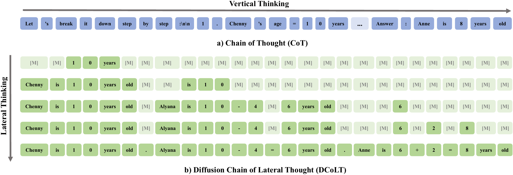

<div align="center">

<h1>Large Language Diffusion with Ordered Unmasking (LLaDOU)</h1>
<p align="center">
<a href="https://arxiv.org/abs/2505.10446"></a>
<a href="https://huggingface.co/maple-research-lab/LLaDOU-v0-Math"></a>
<a href="https://huggingface.co/maple-research-lab/LLaDOU-v0-Code"></a>
</p>

</div>

We introduce the Diffusion Chain of Lateral Thought (DCoLT), a reasoning framework for diffusion language models.

DCoLT treats each intermediate step in the reverse diffusion process as a latent "thinking" action and optimizes the entire reasoning trajectory to maximize the reward on the correctness of the final answer with outcome-based Reinforcement Learning (RL). Unlike traditional Chain-of-Thought (CoT) methods that follow a causal, linear thinking process, DCoLT allows bidirectional, non-linear reasoning with no strict rule on grammatical correctness amid its intermediate steps of thought.



## News

- ```[May 2025]``` Released [LLaDOU v0 Math](https://huggingface.co/maple-research-lab/LLaDOU-v0-Math) and [LLaDOU v0 Code](https://huggingface.co/maple-research-lab/LLaDOU-v0-Code) models, their evaluation code and [technique report](https://arxiv.org/abs/2505.10446).

## Getting Started

### Inference

```python
import torch
from transformers import AutoTokenizer
from networks.lladou_v0 import LLaDOUModelLM, sample

tokenizer = AutoTokenizer.from_pretrained("models/LLaDOU-v0-Math")
model = LLaDOUModelLM.from_pretrained(
    pretrained_model_name_or_path="models/LLaDOU-v0-Math",
    trust_remote_code=True,
    torch_dtype=torch.bfloat16,
    device_map="cuda",
)

problem = "What is the answer of 1+1?"
outputs = sample(
    model,
    problem,
    tokenizer,
    device="cuda",
)
response = outputs["responses"][0]
print(response)
```

### Evaluation

Prepare datasets as following:
```
├── datasets
│   ├── gsm8k
│   │   └── ...
│   ├── MATH
│   │   └── ...
│   ├── mbpp.jsonl
│   ├── mbpp_test.jsonl
│   └── HumanEval.jsonl.gz
```

- For GSM8K and MATH evaluation, please run [scripts/eval_math.sh](scripts/eval_math.sh).
- For MBPP and HumanEval evaluation, please run [scripts/eval_code.sh](scripts/eval_code.sh).

<div align="center"><strong>Evaluation Metrics</strong></div>


## Citation
If this repository helps with your work, please consider giving a star ⭐ and citation 🦖:
```
@article{huang2025reinforcing,
  title={Reinforcing the Diffusion Chain of Lateral Thought with Diffusion Language Models},
  author={Zemin Huang and Zhiyang Chen and Zijun Wang and Tiancheng Li and Guo-Jun Qi},
  journal={arXiv preprint arXiv:2505.10446},
  year={2025}
}
```


